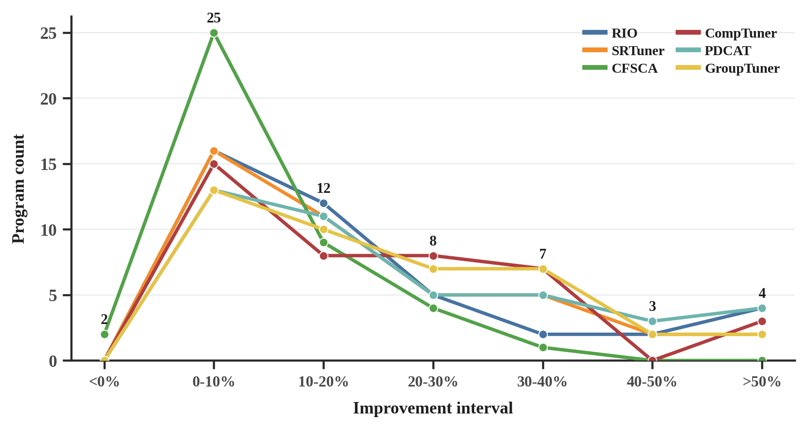
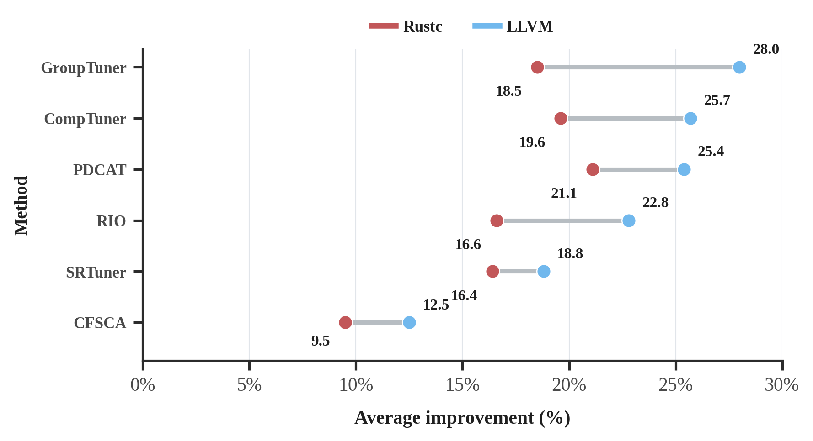
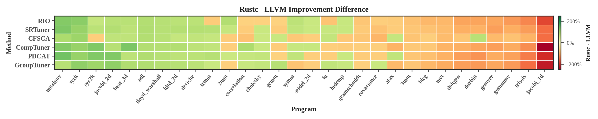
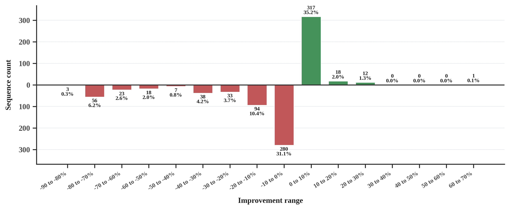
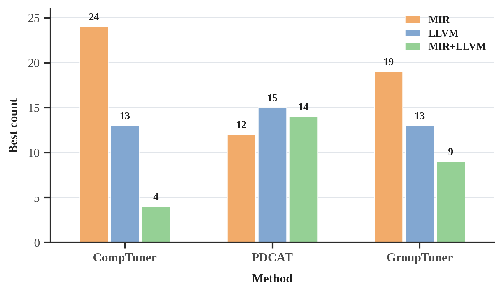

# Can Existing Compiler Auto-tuning Experience Transfer to Rust? An Empirical Study

This repository contains the compact anonymous artifact for the paper. The full evaluation reported in the paper costs 3,791 CPU-hours; reviewers can inspect the summarized data in `data/` and rerun selected experiments with the included scripts.

## Contents

```text
.
|-- data/       summarized speedup data for the main RQ results
|-- figures/    rendered PNG figures
|-- LLVMTuner/  LLVM-side tuning methods and batch runner
`-- RustCTuner/ rustc-side tuning methods and batch runners
```

Benchmark source trees and raw output directories are not included.

## Research Questions and Files

**RQ1: How do existing compiler auto-tuning methods perform on rustc overall?**

Focus: Effectiveness of six tuning methods on 41 Rust benchmarks.

Data: `data/rustc_benchmarks_speedups.json`

Figure: `figures/rustc_method_improvement_bins_line.png`

Runners: `RustCTuner/run_rustc_batch.py`, `RustCTuner/run_runtimebench_batch.py`

**RQ2: Can method performance on LLVM guide per-program method selection in rustc?**

Focus: Whether LLVM-side behavior predicts rustc-side behavior on 30 paired PolyBench programs.

Data: `data/llvm_polybench_speedups.json`, plus the 30 paired PolyBench-rs entries in `data/rustc_benchmarks_speedups.json`

Figures: `figures/llvm_rustc_avg_improvement_slope_dumbbell.png`, `figures/Rustc_minus_LLVM_program_method_direction_heatmap_landscape.png`

Runners: `LLVMTuner/run_llvm_batch.py`, `RustCTuner/run_rustc_batch.py`

**RQ3: Can LLVM-selected pass configurations be reused for rustc tuning?**

Focus: Whether LLVM-selected pass configurations can be reused directly in rustc.

Data: `data/llvm_to_rustc_polybench_transfer_speedups.json`

Figure: `figures/rerun_llvm_to_rustc_transfer_improvement_bins_bar.png`

**RQ4: How should tuning effort be prioritized between MIR and LLVM in rustc?**

Focus: MIR-only, LLVM-only, joint MIR+LLVM tuning, and simple MIR+LLVM configuration combination.

Data: `data/rustc_mir_llvm_ablation_speedups.json`; `data/rustc_benchmarks_speedups.json`; `data/rustc_mir_llvm_combined_joint_speedups.json`

Figure: `figures/rustc_ablation_best_count_grouped_bar.png`

Runner: `RustCTuner/run_rustc_ablation_batch.py`

## Data Format

For the randomized tuning experiments, each pair of method and program is executed five independent times, and we report the median of the five final best valid results. All JSON files store speedups, not percentage improvements. For example, `1.20` means the tuned configuration is 20% faster than the default optimized baseline.

- `data/llvm_polybench_speedups.json`: LLVM-side results for 30 PolyBench/C programs and six methods.
- `data/rustc_benchmarks_speedups.json`: rustc-side results for 41 Rust benchmarks: 30 PolyBench-rs programs and 11 rustc-perf runtime benchmarks.
- `data/llvm_to_rustc_polybench_transfer_speedups.json`: direct reuse results for the top five LLVM-selected configurations on each paired PolyBench program, stored as `rank_1` through `rank_5`.
- `data/rustc_mir_llvm_ablation_speedups.json`: MIR-only and LLVM-only ablation results for 41 Rust benchmarks using `CompTuner`, `PDCAT`, and `GroupTuner`. This file records `1250s` and `2500s` checkpoints.
- `data/rustc_mir_llvm_combined_joint_speedups.json`: RQ4 simple-combination comparison. `combined_mir_llvm` is the concatenated MIR-only plus LLVM-only configuration result; `joint_mir_llvm` is the corresponding 5000s joint MIR+LLVM result.

For RQ2 and RQ3, match paired PolyBench programs by normalizing hyphens and underscores: for example, LLVM `fdtd-2d` corresponds to rustc `fdtd_2d`.

## Figures

The `figures/` directory contains PNG versions of the paper figures referenced in the RQ descriptions above. The short notes below summarize what each figure is intended to show.

**RQ1: rustc improvement distribution**



This figure shows the per-program final improvement distribution after the 5000s rustc tuning budget. Negative bins indicate degradation relative to the default Rust release configuration.

**RQ2: average LLVM-to-rustc method trend**



This figure compares the average improvement of the same six tuning methods on paired LLVM and rustc benchmarks.

**RQ2: program-method transfer differences**



This heatmap shows rustc-minus-LLVM improvement differences for each program and method. Green cells mean the Rust version benefits more from tuning, while red cells mean the LLVM/C version benefits more. It highlights that transfer behavior is strongly program-dependent.

**RQ3: direct configuration reuse**



This figure reports the improvement distribution when LLVM-selected pass configurations are reused directly in rustc. Negative values indicate performance degradation on rustc.

**RQ4: MIR, LLVM, and joint tuning**



This figure counts how often MIR-only, LLVM-only, and joint MIR+LLVM tuning achieve the best result under the 2500s budget.


## Rerunning Selected Experiments

Reference environment used in the paper:

```text
OS: Ubuntu 22.04
CPU: 32 vCPUs on an AMD EPYC 9654 96-Core Processor
Memory: 60 GB
rustc: 1.90.0-nightly
LLVM/Clang: 20.1.8
```

Install Python dependencies:

```bash
python -m pip install numpy scipy scikit-learn pandas
```

Install a nightly Rust toolchain and LLVM/Clang 20 so that these commands are available:

```bash
rustc --version
cargo --version
clang-20 --version
opt-20 --version
```

Clone benchmark suites from the artifact repository root:

```bash
mkdir -p LLVMTuner/Benchmarks
cd LLVMTuner/Benchmarks
git clone https://github.com/MatthiasJReisinger/PolyBenchC-4.2.1.git polyBench
cd ../..

mkdir -p RustCTuner/Benchmarks
cd RustCTuner/Benchmarks
git clone https://github.com/JRF63/polybench-rs.git polybench-rs
git clone https://github.com/rust-lang/rustc-perf.git rustc-perf
cd ../..
```

Run one repeat for a quick check:

```bash
cd LLVMTuner
python run_llvm_batch.py --num_repeats 1

cd ../RustCTuner
python run_rustc_batch.py --num_repeats 1
python run_runtimebench_batch.py --num_repeats 1
python run_rustc_ablation_batch.py --num_repeats 1
```

Use `--num_repeats 5` to run the five independent repeats used by the paper. Generated logs and results are written under `LLVMTuner/results/` and `RustCTuner/results/`.
